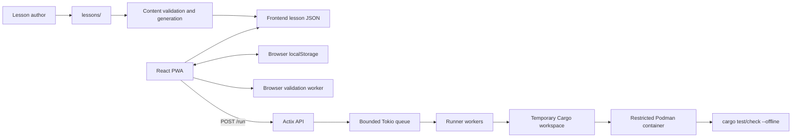
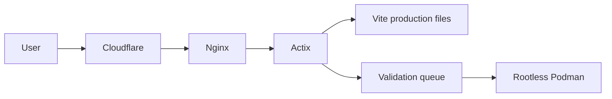

# Rust Daily Architecture

## Overview

Rust Daily is a local-first Progressive Web App with a server-side Rust runner.
The browser owns lesson navigation, editing, drafts, and progress. The backend
has one narrow responsibility: compile and test submitted lesson code in an
isolated container.



The design follows four principles:

1. **Local-first learning:** the app shell, lesson content, drafts, settings, and
   progress do not require an account or server-side persistence.
2. **Authored validation:** checks and solutions come from the curriculum, not
   from AI-generated grading.
3. **Explicit trust boundaries:** submitted Rust runs outside the web process
   with resource and network restrictions.
4. **Source/runtime separation:** author notes and solutions stay in the
   authoring tree and are not shipped as normal lesson content.

The current content set contains 90 schema-V2 lessons in 15 arcs. Every lesson
combines a structural browser check with Cargo-backed validation.

## Repository Boundaries

| Path | Responsibility |
| --- | --- |
| `frontend/` | React UI, lesson loading, browser checks, PWA behavior, and local persistence |
| `backend/` | Actix API, request validation, queueing, workspace creation, and runner orchestration |
| `docker/` | Rust runner image, dependency cache, and advanced Cargo entrypoints |
| `lessons/` | Canonical lesson metadata, starter files, public tests, notes, and reference solutions |
| `config/` | Shared, local, and production backend configuration |
| `docs/` | Product specifications and implementation plans |

## Lesson Content

Each canonical lesson lives under `lessons/<arc>/<lesson>/`:

```text
lesson.json
notes.md
starter/src/lib.rs
tests/public.rs
compile_fail/<case>.rs
solution/src/lib.rs
```

`compile_fail/` is present only for lessons that validate negative
compile-time contracts.

`lesson.json` references source files instead of duplicating their contents. It
also defines ordering, instructions, hints, and one or more validation steps.
The source validator checks schema requirements, referenced paths, arc
continuity, dependency sets, and selected starter/solution invariants.

The generation pipeline:

```text
lessons/
  -> content:validate-source
  -> content:generate
  -> frontend/src/content/lessonIndex.json
  -> frontend/src/content/lessons.json
  -> frontend/src/content/concepts.json
  -> frontend/public/content/lessons/<lesson-id>.json
```

The index contains lightweight navigation metadata. Full lesson details are
separate files so the browser only loads them when needed. Author metadata,
notes, and complete reference solution directories are removed from shipped
lesson records. An explicitly authored final-hint solution snippet may be
included.

### Project Snapshot Model

A lesson may describe a multi-file project, but it has exactly one editable
artifact. Rust modules, fixtures, test data, and tests that are not the focus
of that lesson are read-only context. Future runner modes may extend the same
model to manifests, migrations, and multi-crate workspaces.

Each lesson is an authored project snapshot:

1. The learner edits one focused file.
2. Validation compiles that file with every supplied project file.
3. The next lesson starts from the authored reference solution, not the
   learner's exact submission.
4. When the focus moves to another file, the previous file becomes read-only
   canonical project code.

This keeps each session bounded while allowing an arc to build a realistic
system over several days. It also prevents one valid alternative or earlier
mistake from destabilizing later lessons.

Relevant commands:

```bash
cd frontend
npm run content:validate-source
npm run content:generate
npm run content:check-refs
npm run content:check

cd ..
scripts/test-lesson-solutions.sh
```

`content:check-refs` is deliberately separate from schema validation. It checks
`arcs.json`, concept prerequisites, unique lesson order, and canonical
source-to-generated parity.

## Frontend

`frontend/src/App.tsx` is the application coordinator. It uses hash routes for
the home, lesson, and settings screens. Lesson screens and lesson detail JSON
are loaded lazily; the current and next lesson are prefetched.

The main lesson flow is:

1. Select the first incomplete lesson.
2. Fetch and normalize its detail record.
3. Restore the editable file from a local draft, or use starter code.
4. Save edits to `localStorage` after a short debounce.
5. Run the lesson's validation steps.
6. Record completion only after a passing or explicit self-check result.

The editor intentionally supports one editable file. Other lesson files are
displayed read-only and are included in the validation snapshot when they are
runnable project files. The Cargo adapter submits each supported source, test,
fixture, and test-data file separately; it does not concatenate tests.

### Validation

`frontend/src/validation/validationClient.ts` coordinates validation:

- `structural` checks run in a short-lived Web Worker.
- `backend-cargo-test` sends the complete runnable lesson snapshot to the
  Actix API.
- `backend-compile-fail` sends the same snapshot plus public compile-fail
  cases and expects those cases to fail with authored diagnostics.
- `all` runs configured checks concurrently and aggregates their results.
- A default Cargo compile test is added when a lesson only configures browser
  checks.

The worker is terminated after each result or timeout. Structural checks inspect
the source shape; they are fast feedback, not a Rust parser or compiler.
`browser-rust` exists in the schema but its compiler engine is not implemented.
All current lessons use `all` with structural and backend Cargo steps.

Backend responses are normalized into the frontend validation model.
Compile-fail summaries name the case and any missing or forbidden diagnostic
snippets. Cargo compiler messages are rendered as diagnostics, while Cargo
bookkeeping records such as `compiler-artifact` are discarded.

### Browser Storage

The browser is the only persistence layer:

| Key | Contents |
| --- | --- |
| `rust-daily:v1:progress` | Attempts, completions, and concept progress |
| `rust-daily:v1:draft:<lesson-id>` | Editable lesson draft |
| `rust-daily:v1:settings` | Theme, editor font size, and motion preference |

Progress can be exported and imported as versioned JSON. Storage reads are
validated and fall back to defaults when data is missing or malformed.

### PWA Caching

Vite and Workbox generate the service worker. The production app precaches its
shell, uses cache-first handling for static assets, and network-first handling
for lesson detail JSON. Cargo-backed validation still requires the backend.

## Backend

The backend is an Actix application with three routes:

| Route | Purpose |
| --- | --- |
| `GET /healthz` | Service health |
| `POST /run` | Validate, compile, and test a lesson submission |
| `/*` | Serve the production frontend |

The `/run` path crosses these modules:

```text
api -> service -> model validation -> bounded queue
    -> runner worker -> temporary workspace -> Podman -> Cargo
```

- `api.rs` owns HTTP extraction and response mapping.
- `service.rs` coordinates validation and dispatch behind the semantic
  `RunDispatcher` application port.
- `model.rs` owns accepted paths, size limits, dependency sets, and result
  types.
- `queue.rs` provides backpressure with a bounded Tokio channel and fixed
  worker count.
- `workspace.rs` creates an isolated Cargo project per request.
- `runner.rs` owns a uniquely named managed Podman container per request,
  applies the request deadline, classifies structured Cargo output, caps
  combined raw stdout/stderr, and guarantees bounded container/workspace
  cleanup. Pure command specifications and an injected process executor keep
  sandbox flags and failure paths deterministic to test.

The API accepts a backend-controlled single-crate snapshot with these path
families:

```text
src/**/*.rs
tests/**/*.rs
fixtures/**
testdata/**
```

Each request must include `src/lib.rs` and at least one `tests/**/*.rs` file.
Requests select either the `std` or `advanced` dependency set. `Cargo.toml`,
lockfiles, build scripts, target directories, benches, examples, migrations,
and arbitrary paths are rejected; the backend always generates the manifest.
The snapshot transport preserves the one-editable-artifact product invariant
without adding multi-file editor state.

`mode: "cargo-test"` is the default and runs `cargo test`. `mode:
"compile-fail"` first checks the library, then writes each authored
`compileFailCases` entry as `tests/compile_fail_<case>.rs` and runs
`cargo check --test <case>`. Compile-fail case paths are validated separately
under `compile_fail/**/*.rs`; they are never accepted as normal project files.

Run results use one of these statuses:

```text
passed
failed
compile_error
timed_out
internal_error
```

Invalid payloads return structured `400` or `413` responses. A full queue
returns `429` immediately rather than allowing unbounded work.

## Runner Isolation

Each request gets one uniquely named managed container. The prepared host input
is mounted read-only at `/input`, copied into a bounded `/workspace` tmpfs, and
never exposed as a writable host mount. Podman starts the container with:

- no network;
- a read-only container filesystem;
- a bounded memory, CPU, and process count;
- dropped Linux capabilities;
- `no-new-privileges`;
- a small `noexec` `/tmp` and a size-bounded writable `/workspace`;
- a non-root numeric user;
- disabled proxy and container logging integration;
- inner command timeouts, a native container timeout, and one absolute request
  deadline that includes queueing and cleanup.

Queued requests complete as timed out when their deadline expires; the closed
response channel prevents a later worker from starting them. Compile-fail
expectations match only structured rustc error diagnostics. Warning text cannot
satisfy an expected-error snippet.

Startup refuses to serve traffic unless Podman reports rootless mode, the
configured local image exists, and managed stale containers can be reconciled.
Cancellation and output overflow both terminate the identified container with
a bounded cleanup timeout.

Cargo runs with `--offline`. The `std` set has no external dependencies. The
`advanced` set includes a predefined ecosystem surface, including Serde, Tokio,
tracing, thiserror, Actix, and proptest.

Advanced dependencies and compiled artifacts are cached in the runner image.
At runtime, the cached target directory is copied into the writable lesson
workspace before advanced Cargo commands run. The dependency declarations in
`backend/src/dependency_set.rs`, `docker/rust-runner.Dockerfile`, the runner
wrapper scripts, and the solution test harness must remain synchronized.

## Configuration

Backend settings are loaded in this order:

1. `config/default.yaml`
2. `config/<RUST_DAILY_ENV>.yaml`
3. `RUST_DAILY_*` environment overrides

Configuration controls the typed bind address and CORS origin, static frontend
path, queue size, worker count, runner and cleanup deadlines, response and raw
process output limits, workspace tmpfs size, image, workspace root, path and
diagnostic limits, and request size limits. Typed configuration rejects empty,
zero-valued, inconsistent, or unsafe settings before startup.

Local development runs Vite and Actix on separate origins. Production uses one
origin, so the frontend posts to `/run`; Actix CORS middleware still pins the
accepted browser origin to `https://borrowquest.qzz.io` and rejects requests with
any other `Origin` header. This is browser request hygiene only; non-browser
abuse is handled by rate limits, queue bounds, and runner isolation.

## Production Deployment



Pushes to `main` trigger the VPS workflow in
`.github/workflows/deploy_dev.yml`. It builds the frontend and release backend,
copies them with configuration and runner assets, installs the systemd and
Nginx configuration, and restarts the service.

The workflow does not build the Podman runner image. That image is rebuilt
deliberately under the production service account when the Rust version,
dependency sets, Dockerfile, or runner entrypoint changes.

The live deployment is [borrowquest.qzz.io](https://borrowquest.qzz.io/).
Operational details are in [docs/DEPLOYMENT.md](docs/DEPLOYMENT.md).

## Trust Model and Constraints

- User code is untrusted; the Podman runner is the host protection boundary.
- Runtime, Podman, Cargo infrastructure, and internal compiler failures return
  generic internal errors rather than learner pass/fail outcomes.
- Compile-fail expectations match only structured rustc error diagnostics; Cargo
  noise, warnings, and runtime text cannot satisfy expected snippets.
- Public tests are shipped to the browser and submitted by the client. The
  service provides practice feedback, not tamper-resistant grading.
- The backend has no durable store for user code, progress, drafts, or accounts.
  Host input workspaces and managed containers are removed during bounded
  cleanup.
- Lesson execution compiles a backend-controlled single-crate project snapshot
  while exposing exactly one editable artifact.
- Offline mode supports the app shell, cached lessons, editing, and local
  state. It does not provide Cargo compilation.
- Adding a dependency set requires coordinated backend, image, harness, schema,
  and content updates.

Product behavior and curriculum requirements are defined in
[docs/SPEC.md](docs/SPEC.md). Future runner and curriculum evolution is defined
in
[docs/FUTURE_ADVANCED_CONCEPTS_IMPLEMENTATION_PLAN.md](docs/FUTURE_ADVANCED_CONCEPTS_IMPLEMENTATION_PLAN.md).
